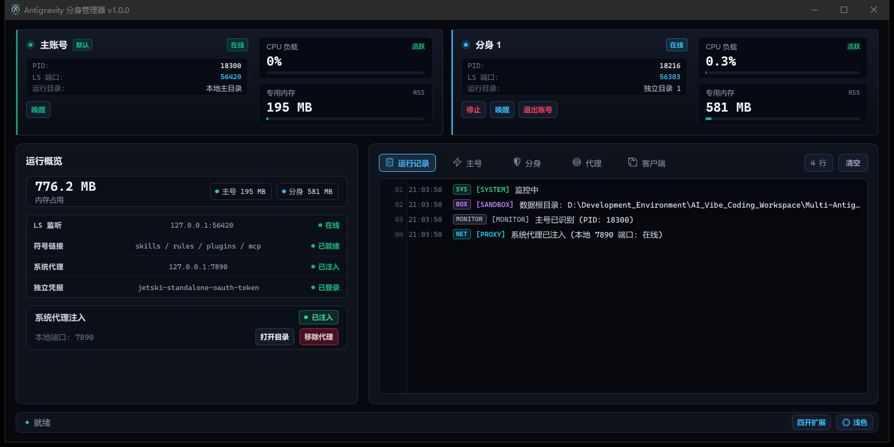

<div align="center">


# Multi-Antigravity

**Google Antigravity 多开分身工具**

[](https://github.com/GVHBOX/multi-antigravity/actions/workflows/ci.yml)
[](LICENSE)
[](https://github.com/GVHBOX/multi-antigravity)
[](https://www.rust-lang.org/)
[](https://slint.dev/)

<br/>



</div>

---

## 作用

双击 `Multi-Antigravity.exe`启动
- **系统代理**：工具有让Google Antigravity支持系统代理，点击“注入”即可
- **分身**：最多支持4个分身，开分身登录，账号数据保存在 `data/` 目录中，主账号和分身不冲突。

---

## 常见问题（FAQ）

**Q：需要先退出正在运行的主号吗？**  
不需要。主号与分身彼此完全独立，主号正在使用时可直接启动分身。

**Q：分身的数据保存在哪里？**  
保存在程序所在目录的 `data/` 文件夹下。如果你想备份、迁移或者删除分身数据，直接操作该文件夹即可。

**Q：会泄露我的账号凭据或上传隐私数据吗？**  
不会。分身直接连接 Google 官方服务器，本工具不架设网络中转，所有登录凭据仅保存在你本机的 `data/` 目录中，不收集也不上传任何数据。

**Q：点击「启动」后没有弹出窗口？**  
请确认你的电脑上已经正常安装了官方 Google Antigravity 客户端（默认安装路径为系统 `AppData\Local\Programs\antigravity`）。

---

## 键盘快捷键速查

| 按键 | 功能 |
| :---: | :--- |
| <kbd>Space</kbd> | 启动 / 停止分身 |
| <kbd>K</kbd> | 停止分身进程 |
| <kbd>R</kbd> | 重启分身服务 |
| <kbd>C</kbd> | 清除登录凭据（登出） |
| <kbd>O</kbd> | 打开分身数据目录 |
| <kbd>L</kbd> | 切换运行日志与服务日志 |
| <kbd>P</kbd> | 开关本地 7890 代理 |

---

### 开发
需要 Rust 1.85+ 及 MSVC 构建环境：
```powershell
cargo build --release
```
编译产物位于 `target\release\multi-antigravity-rust.exe`，复制至根目录重命名为 `Multi-Antigravity.exe` 即可。

---

## 开源协议

本项目采用 [MIT License](LICENSE) 开源。
